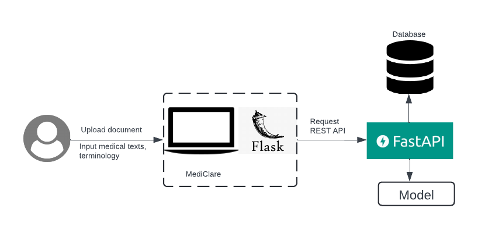
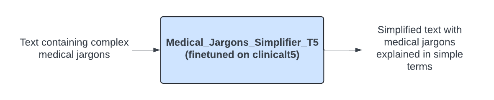
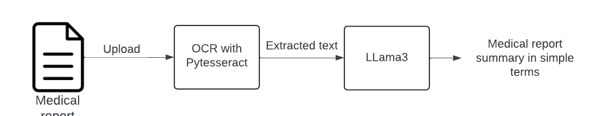

# MediClare : A Comprehensive Medical Jargons Simplifier App

## Problem Description
In the field of healthcare, medical terminology and jargon can be highly complex and difficult for non-medical professionals to understand. This complexity often creates barriers for patients and caregivers in comprehending medical reports, diagnoses, and treatment options. There is a significant need for tools that can simplify medical jargon and provide accessible explanations to improve health literacy among the general population.

## Purpose of the Product
The **MediClare- Medical Jargon Simplifier App** aims to address the challenges associated with complex medical language by providing a comprehensive solution for translating, explaining, and simplifying medical jargon. This product is designed to enhance accessibility to medical information, empower patients and caregivers with understandable health insights, and facilitate better communication between healthcare providers and their patients.

## Key Functionalities 

### 1. Medical Text Translator
- **Purpose**: Translates complex medical text into simple, easy-to-understand language.
- **How It Works**: You input medical text (sentence or paragraph), and it provides explanations in plain language.

### 2. Medical Terminology Simplifier Chatbot
- **Purpose**: Answers questions about medical terms and topics in simple terms.
- **How It Works**: Interacts with users to provide information from a knowledge base of medical documents.

### 3. Medical Report Simplifier
- **Purpose**: Simplifies medical reports by extracting text from images or PDFs and summarizing key information.
- **How It Works**: Upload your medical reports, and it generates concise summaries in simple terms.

## System Architecture

    
    
<em>Figure 1: System Architecture Diagram</em>

### 1. User Interface:
- **Technology**: Built using Flask, a lightweight web framework for Python.
- **Functionality**: 
  - Allows users to upload medical documents (e.g., images, PDFs).
  - Provides input fields for users to enter medical texts or terminologies they want to simplify.
  - Sends user inputs to the backend for processing via REST API requests.

### 2. Backend (FastAPI):
- **Technology**: Implemented using FastAPI, a modern, fast web framework for building APIs with Python.
- **Functionality**: 
  - Receives REST API requests from the Flask frontend.
  - Interfaces with the database and models to process the user inputs.
  - Returns the simplified medical text or summarized document back to the frontend.
### 3. Model:
- Includes multiple models for medical text simplification.
### 4. Database:
- Stores input and output of each simplified medical text which is later provided to doctor(expert) for validation and helps in retraining.

## Models
## 1. Medical Text Translator

    
    
<em>Figure 2: Medical Text Translator architecture</em>

### Model Training Pipeline

### i. Data Collection
Various data sources are:
- **cbasu/Med-EASi**
- **MTSamples**
- **SimMedLexSp**
- **PLABA**
- **https://github.com/myTomorrows-research/public/tree/5b054a88746b7d4422732e2fd3ee6a77a8a53918/WWW2019**
- **https://github.com/AshOlogn/Paragraph-level-Simplification-of-Medical-Texts/tree/main/data**

## 2. Medical Report Simplifier

    
    
<em>Figure 3: Medical report Simplifier architecture </em>

### Purpose
Enables users to easily understand complex medical documents by transforming them into straightforward summaries.

### How It Works
- **Upload**: Users upload medical reports in formats such as images or PDFs.
- **Text Extraction**: Utilizes Optical Character Recognition (OCR) via Pytesseract to extract text from the uploaded documents.
- **Text Simplification**: The extracted text is processed using the LLama3 model, which simplifies the medical jargon into plain language.
- **Summary Output**: Delivers a concise, easy-to-understand summary of the medical report.

## 3. Medical Terminology Simplifier Chatbot

    
    
<em>Figure 4: Chatbot architecture</em>

### Purpose
Provides instant explanations of complex medical terms and jargon to users, making medical information more accessible and understandable.

### Technology
- Langchain
- Llama3 from Ollama

### How It Works
It uses the concept of Retrieval Augmented Generation(RAG).
- **Query Input**: Users submit questions or terms they need explained.
- **Data Processing**:
  - **Loader**: Loads medical terms from a CSV dataset.
  - **Text Processing**: A Recursive Text Splitter segments complex terms for processing.
  - **Embedding**: Terms are converted into vector embeddings using a Hugging Face model for semantic understanding.
- **Search and Retrieval**:
  - **Vector Storage**: Embeddings are stored in a `faiss-gpu` vector database for quick retrieval.
  - **Retrieval**: The LangChain retriever matches user queries with relevant terms and explanations based on vector similarity.
- **Response Generation**:
  - **Contextual Understanding**: The LLama3 model uses the query and session history to generate a context-aware response.
  - **Memory Management**: Responses are stored temporarily to maintain context throughout the session, enhancing the interaction quality.
- **User Interaction**: Delivers simplified explanations directly to the user.
