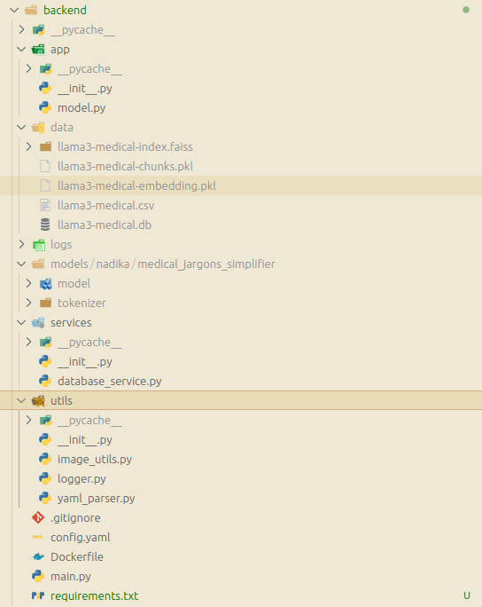
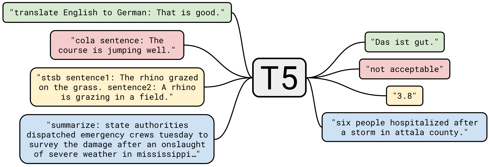
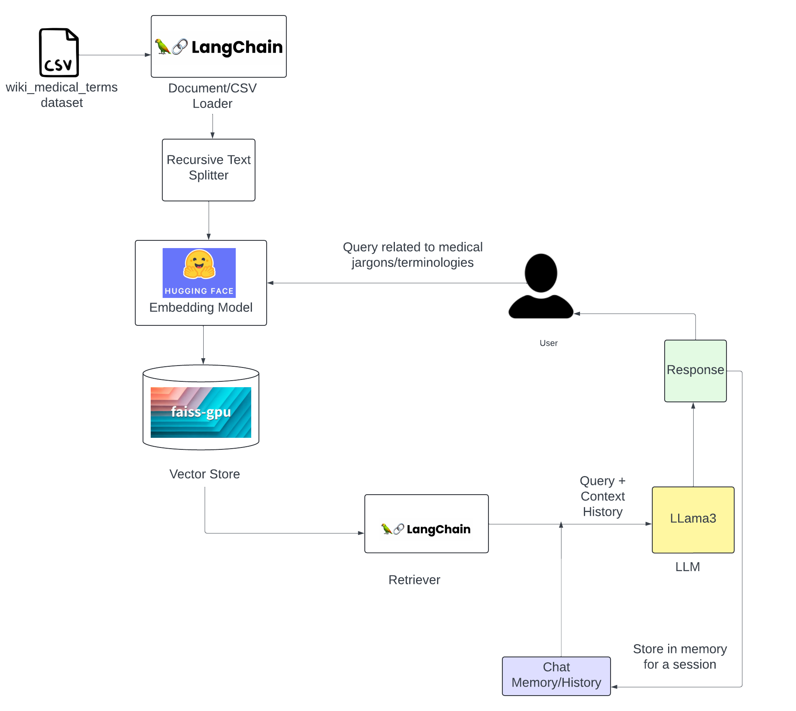
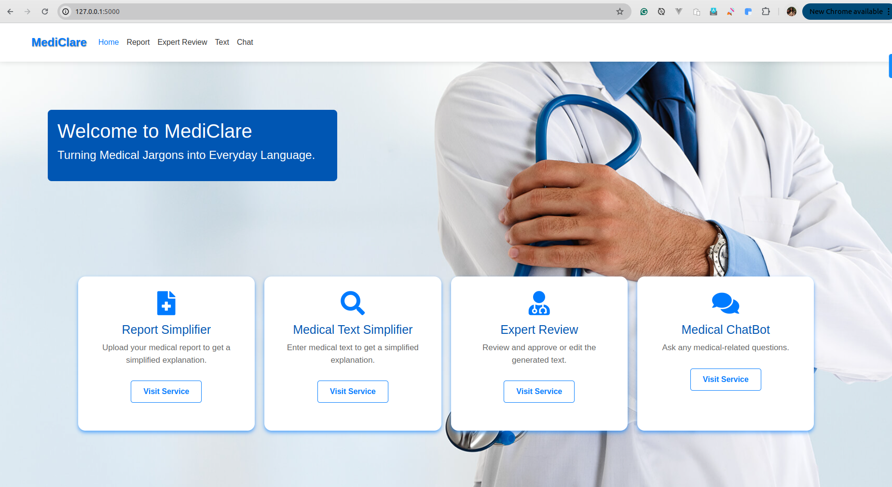
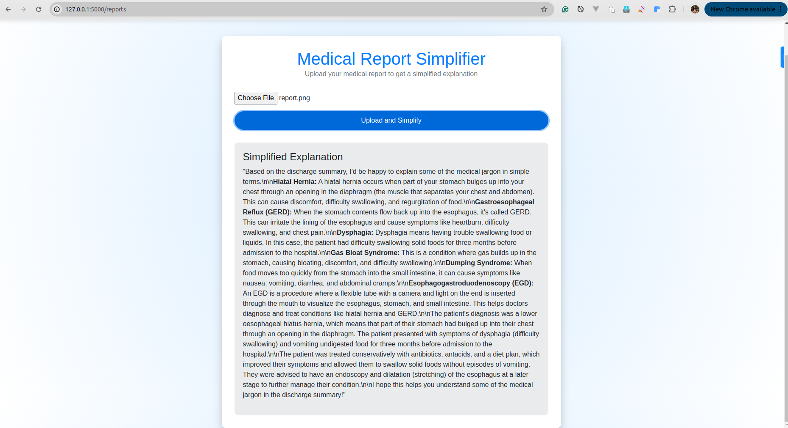
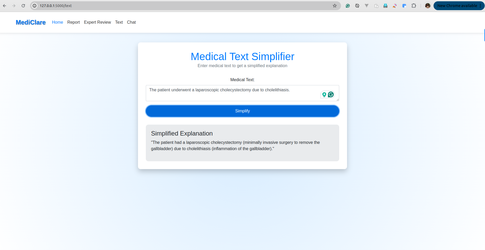
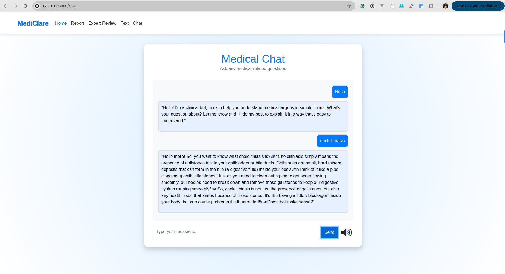
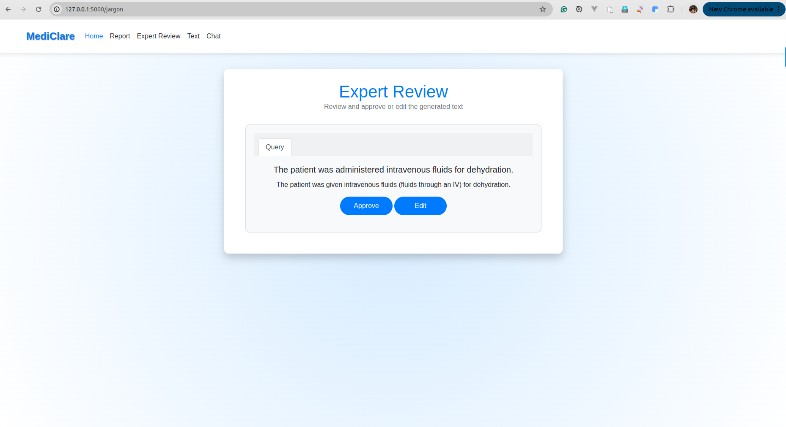

# MediClare : A Comprehensive Medical Jargons Simplifier App

## Problem Description

In the field of healthcare, medical terminology and jargon can be highly complex and difficult for non-medical professionals to understand. This complexity often creates barriers for patients and caregivers in comprehending medical reports, diagnoses, and treatment options. There is a significant need for tools that can simplify medical jargon and provide accessible explanations to improve health literacy among the general population.

## Purpose of the Product

The **MediClare- Medical Jargon Simplifier App** aims to address the challenges associated with complex medical language by providing a comprehensive solution for translating, explaining, and simplifying medical jargon. This product is designed to enhance accessibility to medical information, empower patients and caregivers with understandable health insights, and facilitate better communication between healthcare providers and their patients.

## Key Functionalities

### 1. Medical Text Translator

- **Purpose**: Translates complex medical text into simple, easy-to-understand language.
- **How It Works**: You input medical text (sentence or paragraph), and it provides explanations in plain language.

### 2. Medical Terminology Simplifier Chatbot

- **Purpose**: Answers questions about medical terms and topics in simple terms.
- **How It Works**: Interacts with users to provide information from a knowledge base of medical documents.

### 3. Medical Report Simplifier

- **Purpose**: Simplifies medical reports by extracting text from images or PDFs and summarizing key information.
- **How It Works**: Upload your medical reports, and it generates concise summaries in simple terms.


## Demo Video
[Watch the demo video on Google Drive](https://drive.google.com/uc?export=download&id=1Xm7rhsxKsSrRii9Nhz_Qx_T0byiEKZue)

[](https://drive.google.com/file/d/1Xm7rhsxKsSrRii9Nhz_Qx_T0byiEKZue/view?usp=sharing)
## Build it yourself

### Requirements

- Ollama installed system with llama3 model downloaded

  - ollama should be up and serving the port 11434, this installs ollama system-wide, referenced from [ollama page](https://ollama.com/download).

  ```bash
    curl -fsSL https://ollama.com/install.sh | sh
  ```

  - download llama3, make sure you are running this on a capable system with a dedicated gpu.

  ```bash
    ollama install llama3
  ```

- Setup our app

  - Clone the repository

  ```bash
    git clone https://github.com/krishbin/mediClare.git
  ```

  - Setup Backend

  ```bash
    cd backend
    python3 -m venv .venv
    source .venv/bin/activate
    pip3 install torch torchvision torchaudio --index-url https://download.pytorch.org/whl/cu118
    pip install -r requirements.txt
  ```

  - Run backend

  ```bash
    uvicorn main:medicalsearch --host 0.0.0.0 --port 8000 --reload
  ```

  - Setup Frontend

  ```bash
    cd frontend
    python3 -m venv .venv
    source .venv/bin/activate
    pip install -r requirements.txt
  ```

  - Run Frontend

  ```bash
    python3 main.py
  ```

## System Architecture

This is a tier-3 architecture where we have tried to isolate work to defined entities. The backend is served with fastapi which interacts with two services, ollama and database. The user is the source of the information who has the ability to interact with the backend services through a simple UI wrapper written in Flask and HTML.

<div align="center">
    
    <p><em>Figure 1: System Architecture Diagram</em></p>
</div>

### 1. User Interface:

- **Technology**: Built using Flask, a lightweight web framework for Python.
- **Functionality**:

  - Allows users to upload medical documents (e.g., images, PDFs).
  - Provides input fields for users to enter medical texts or terminologies they want to simplify.
  - Sends user inputs to the backend for processing via REST API requests.
  <div align="center">
      
  </div>

- Frontend web hierarchy
  - /reports: upload your report in image and get a simplified <br>
  - /text: enter the medical term and get a simplified result
  - /chat: history aware chat to have a conversation about medical data

### 2. Backend (FastAPI):

- **Technology**: Implemented using FastAPI, a modern, fast web framework for building APIs with Python.
- **Functionality**:

  - Receives REST API requests from the Flask frontend.
  - Interfaces with the database and models to process the user inputs.
  - Returns the simplified medical text or summarized document back to the frontend.

  <div align="center">
    
  </div>

  The backend is written in fastapi which provide multiple api to perform some action on the data that is sent to the cloud.

  **Folder Hierarchy**

  - **utils**: A utilities folder I like to migrate to every python project.
    It give an ability to log individual files and debug your program. Also it add a yaml parser so that you can write your configuration for the project in a single file and access it everywhere.
  - **services**: It incorporates all the services that are needed for the project.

    - Database Service: A wrapper around MySQL connnector to provide project specific needs.

  - **app**: The main brains of the project. App holds different abstractive classes that provides you all the llm and t5 based interfaces.

    - Model: It setups the T5 model and provides a way to interface with it.
    - Chatbot: It setups the ollama connection and provides and interface to interact with ollama models.

  - **data**: holds some data required for project, we have cached the indexing and chunks that are always required for the project for faster startup.

  - **models**: saves the T5 model locally or any other model specified in the configuration

  - **logs**: generates a file specific log for easier debugging

  **Available Endpoints**

  - {server_url}/simplify_data <br>
    provides an interface for our self trained T5 text-to-text transformer
  - {server_url}/simplify_text_llm <br>
    provides an interface to send data to a self hosted llama3 server
  - {server_url}/simplify_image_report_llm <br>
    similar to /simplify_data but adds image aware context
  - {server_url}/simplify_text_llm_context <br>
    gives an ability to talk to ollama3 which is aware about your past prompts

### 3. Model:

- Includes multiple models for medical text simplification.

### 4. Database:

We are using a MySQL database hosted with docker. To replicate a **docker-compose.yml** file is provided in the database folder within this project.

- Stores input and output of each simplified medical text which is later provided to doctor(expert) for validation and helps in retraining.

## Models

## 1. Medical Text Translator

To translate medical text into simplified text with explanation of medical jargons in simple terms, we finetune the model T5, also known as Text-To-Text-Transfer-Transformer.

T5 is a transformer model trained using a unique approach that treats every NLP task as a text-to-text problem. So, every task, regardless of its nature, is framed as generating a text output from a text input.

In a multitask setting, each task gets its own specific task prefix, which describes what task the model is supposed to perform.

<div align="center">
    
    <p><em>Figure 1: T5 task prefixes</em></p>
</div>

For our text simplification task, we add our custom task prefix "simplify: ". If we want to later extend our model for other tasks like medical text summarization and question answering, we can extend our model with task prefixes for those tasks in a multi-task training setup.

<div align="center">
    
    <p><em>Figure 2: Medical Text Translation Model</em></p>
</div>

### Model Training Pipeline

### i. Data Collection

The data has been collected from various sources such as:

- **cbasu/Med-EASi**
- **MTSamples**
- **SimMedLexSp**
- **PLABA**
- **https://github.com/myTomorrows-research/public/tree/5b054a88746b7d4422732e2fd3ee6a77a8a53918/WWW2019**
- **https://github.com/AshOlogn/Paragraph-level-Simplification-of-Medical-Texts/tree/main/data**

We were able to extract some text pairs that can be considered fairly clean from these datasources.

Apart from that, some text pairs were also obtained with the help of LLMs as follows:

- Some medical descriptions from MEDLANE were given to an LLM for text simplification.
- Some unclean text pairs from the above mentioned data sources were given to an LLM to construct clean text pairs.
- We also instructed an LLM to generate text pairs like the ones we have obtained from the above mentioned procedures.

### ii. Model Training

We finetuned T5-base on the text pairs obtained from our data collections process. The medical texts were appended with the "simplify: " task prefix before feeding the text pairs into the model during training.

The following hyperparameters were used during training:

- learning_rate: 3e-05
- train_batch_size: 4
- eval_batch_size: 4
- seed: 42 _(for random data split)_
- optimizer: Adam with betas=(0.9,0.999) and epsilon=1e-08
- lr_scheduler_type: linear
- lr_scheduler_warmup_steps: 1000
- num_epochs: 10
- weight_decay=0.01

### iii. Model Evaluation

The model was evaluated using the following metrics:

- Cross-Entropy Loss: It quantifies the difference between the predicted probability distribution and the true distribution of labels.
- Rouge1: Measures unigram (word) overlap between generated and reference summaries.
- Rouge2: Measures bigram (two consecutive words) overlap between generated and reference summaries.
- RougeL: Measures the longest common subsequence (LCS) overlap, capturing sentence-level structure similarity.

The model achieves the following results on our evaluation set:

- Loss: 0.0221
- Rouge1: 0.8485
- Rouge2: 0.7157
- RougeL: 0.8451

### Model validation (Expert feedback):
All the input-output pairs generated from the model will be saved in the database which will be send to the expert(doctor or health-care professionals) to approve it if correct and edit it if the model prediction is not satisfiable. The validated output will then be used to retrain the model .

## 2. Medical Report Simplifier

<div align="center">
    
    <p><em>Figure 3: Medical report Simplifier architecture </em></p>
</div>

### Purpose

Enables users to easily understand complex medical documents by transforming them into straightforward summaries.

### How It Works

- **Upload**: Users upload medical reports in formats such as images or PDFs.
- **Text Extraction**: Utilizes Optical Character Recognition (OCR) via Pytesseract to extract text from the uploaded documents.
- **Text Simplification**: The extracted text is processed using the LLama3 model, which simplifies the medical jargon into plain language.
- **Summary Output**: Delivers a concise, easy-to-understand summary of the medical report.

## 3. Medical Terminology Simplifier Chatbot

<div align="center">
    
    <p><em>Figure 4: Chatbot architecture</em></p>
</div>

### Purpose

Provides instant explanations of complex medical terms and jargon to users, making medical information more accessible and understandable.

### Technology

- Langchain
- Llama3 from Ollama

### How It Works

It uses the concept of Retrieval Augmented Generation(RAG).

- **Query Input**: Users submit questions or terms they need explained.
- **Data Processing**:
  - **Loader**: Loads medical terms from a CSV dataset.
  - **Text Processing**: A Recursive Text Splitter segments complex terms for processing.
  - **Embedding**: Terms are converted into vector embeddings using a Hugging Face model for semantic understanding.
- **Search and Retrieval**:
  - **Vector Storage**: Embeddings are stored in a `faiss-gpu` vector database for quick retrieval.
  - **Retrieval**: The LangChain retriever matches user queries with relevant terms and explanations based on vector similarity.
- **Response Generation**:
  - **Contextual Understanding**: The LLama3 model uses the query and session history to generate a context-aware response.
  - **Memory Management**: Responses are stored temporarily to maintain context throughout the session, enhancing the interaction quality.
- **User Interaction**: Delivers simplified explanations directly to the user.

<br>

## How MediClare maintains user-privacy
The main agenda here was to serve the application to the user. We used Flask here for rapid development but our ideal case scenario was a native mobile app. Here flask is idealized to be just a frontend wrapper and provide a easy functionality that we wanted to add. We are aligning towards a mobile app because

- **Security:** Your data is always with you and your sensitive information is always anonymized when it leaves the phone, leaving no trace of who you are.

- **Privacy:** On device information processing to hide the sensitive information before they are sent to the cloud.

## Application Overview

<div align="center">
    
    <p><em>Figure 5: MedClare Homepage</em></p>
</div>
<div align="center">
    
    <p><em>Figure 6: MedClare Report Page</em></p>
</div>
<div align="center">
    
    <p><em>Figure 7: MedClare Medical Term</em></p>
</div>
<div align="center">
    
    <p><em>Figure 8: MedClare Chatbot</em></p>
</div>
<div align="center">
    
    <p><em>Figure 9: MedClare Expert</em></p>
</div>